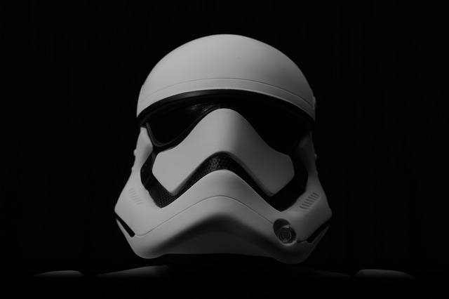
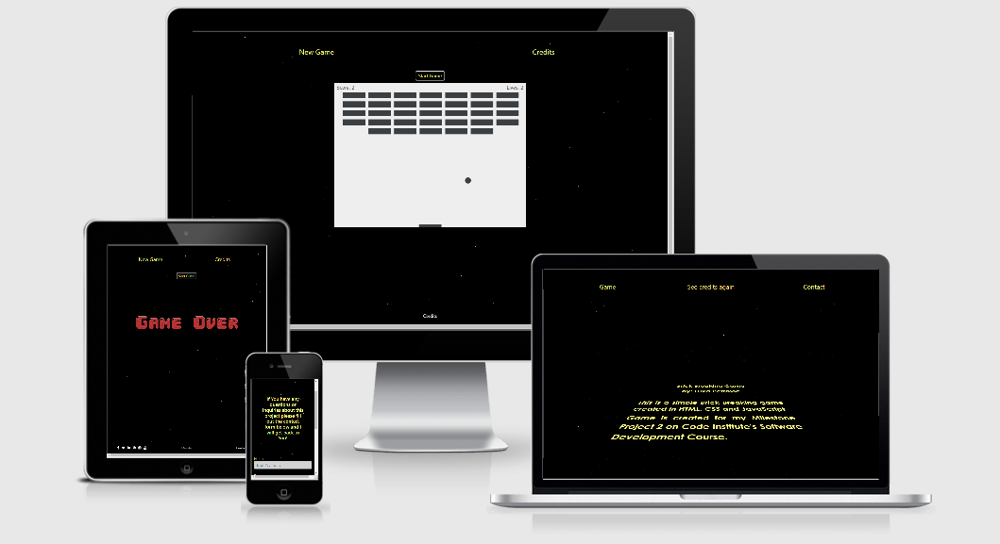

# Brick Breaker Game

For my **Milestone Project 2** in **Code Institute's Diploma in Software Development** course I have Created a Brick Breaking Game.

For link to the website click [Here](https://luka-pp.github.io/MS2/)

The game is designed for desktop user's, but it can be used on smaller screens.

## Who is this game for?

This game is created to showcase the usage of JavaScript. It is intended for anyone 
who likes the trip down the memory lane when this kind of games were at their highest. 
It is also created for all the fans of the Star Wars Saga. 

## What does it do?

This is a simple brick breaking game. The user (player) has a goal to destroy all the bricks on the wall.
The bricks are destroyed using moving ball and the paddle. When all the bricks are destroyed or all the lives are lost 
the game is finished.

## User Experience

### User Stories

* As a user I want to be able to navigate the website clearly and logically
* As a user I want to play enjoyable and stress free game
* As a user I want to track my score
* As a user I want to be able to control the paddle with mouse
* As a user I want to see who created a game
* As a user I want to be able to contact the creator of the game

#### Fulfilment

* Navigation, Foooter and the pages content are laid out in a clear and logical way to guide user to his/hers desired location
* The game is made and designed to be enjoyable and easy to play
* The game is made that it tracks players score. Score is located in top right corner of the game screen
* The game takes controls from the arrow keys of the keyboard and from the movement of the mouse
* Separate credits page is created and on each of the pages user gave an option to visit it and see the games credits
* Contact page is created that allows user to fill in the contact form and get in touch with the creator

## UX 5 Planes

### Strategy Plane

The game is created to showcase the abilities of HTML, CSS and specially JavaScript.
The theme of the whole website is Star Wars Saga. The game is designed to be simple and effective
and to use keyboard or muse for the controls.

### Scope Plane
Features included in this Project

* Three different pages
* Game screen done with canvas element
* Star Wars Inspired Credits Page
* Contact page with a contact form

### Structure Plane

Website consists of 3 separate pages and each of the pages have its specific purpose.
To get the desired effect of the Star Wars opening theme the credits page plays audio 
automatically on load. 

#### Header

Header consists of links/buttons and their purpose is:

* Game Page

Links/Buttons for new game to start the game and to go on the credits page

* Credits Page

Links/Buttons for game page, to see the credits again and to go on the contact page.

* Contact Page

Consists of two links, one to game page nad the other to credits page

#### Footer

Footer consists of the Social icons which redirect user to desired social network.
It also has 2 links to credits and contact page.

The Credits Page does not have the footer due to specific animation of the credits.

#### Game Page

This is the main page if the site. It consists of the header, game area and footer.
The game starts on the click on the **Start Game** button. The goal of the game is 
to destroy all the brick on the wall. Player has 3 lives and looses a life each time
the ball hits the bottom wall. Player controls the paddle with keyboard arrows left and right or movement of the mouse. 
Player can keep track of the lives left in the top left corner of the game screen and his/hers 
score in the top right corner of the game screen. Each broken brick gives player 1 point and maximum 
points player can have is 35. If player looses all the lives the **Game Over** image will show.
If the player destroys all the bricks the **Trophy** image will show.

#### Credits Page

This page consists of header and a crawl credits.
This page has been inspired by the Star Wars opening credits. When the page is 
loaded Star Wars Theme song will start playing and the text will start to 
emerge from the bottom of the screen and it will gradually disappear on top of the page.

#### Contact Page

This page consists of a header, short introduction text, contact form and footer.

### Skeleton Plane

This game is designed to be used on Desktop screens but it can be used on smaller screens

Wireframes are done on paper, which can be seen [Here](./assets/doc/wireframes.pdf)

### Surface Plane

This website uses black background with the stars effect.
The stars are created using JavaScript. On every load of the website
Javascript creates 100 stars on a random positions on the screen.

Credits page features the crawl text inspired by the Star Wars Saga
and it is executed by CSS.

Audio For the credits page is handled by JavaScript.

## Features

### Existing Features

* Created in HTML, CSS, Bootstrap and JavaScript
* 3 different pages
* Canvas Element utilised for a 2D Brick Breaking Game with no external libraries
* Crawl style and Star Wars inspired credits
* Contact form

### Features for future implementation

* Full responsiveness with mobile controls
* High scores list  
* New levels of the game
* Sound manager for game events and for credits page
* Contact Forms to work fully

## Technologies used

* [HTML5](https://en.wikipedia.org/wiki/HTML) for markup
* [CSS3](https://en.wikipedia.org/wiki/CSS) for style
* [Git](https://git-scm.com/) for version control
* [GitHub](https://github.com/) for keeping the files, documents and deployment of the website
* [Bootstrap](https://getbootstrap.com/) for main frame of the website
* [JavaScript](https://www.javascript.com/) For game and background functionality
* [WebStorm](https://www.jetbrains.com/webstorm/) As my main editor

## Resources

* [pixabay](https://pixabay.com/) for images with free license
* [Code Institute](https://codeinstitute.net/) course materials
* [Code Institute](https://codeinstitute.net/) Slack Community
* [MDN](https://developer.mozilla.org/en-US/)
* [Stackoverflow](https://stackoverflow.com/)
* [Youtube](https://www.youtube.com/)
* [W3schools](https://www.w3schools.com/)
* [Am I Responsive](http://ami.responsivedesign.is/) for a responisve image in Read Me
* [Soda PDF](https://www.sodapdf.com/jpg-to-pdf/) to convert images to PDF
* [MDN Game section](https://developer.mozilla.org/en-US/docs/Games/Tutorials/2D_Breakout_game_pure_JavaScript) For main game idea and source code
* [DEV.TO](https://dev.to/christopherkade/developing-the-star-wars-opening-crawl-in-htmlcss-2j9e) For help and inspiration regarding Credits Page
* Star Wars Theme song and Star Wars Related images are the property of Walt Disney Company

## Testing

### Browser Testing

Website has been tested in Google Chrome, Microsoft Edge, Safari, Firefox and Opera.

It was tested on two mobile devices OnePlus and Apple Iphone. Both thsts confirmed that website works with limited functionality.

On each browser the website works as intended visually and all the functionality of the website works as intended. 

There is work to be done for full functionality on mobile devices.

### Validators

The website has been through 3 validators:

* JSHint: app.js, components.js and credits.js have been through the validator and no errors have been reported

* W3C Jigsaw: style.css have been through and there are no errors to report.

* W3C HTML: index.html, credits.html and contact.htm have been through and there are no errors to report.

### Local Testing

Local testing of all the buttons links and general functionality of the website has been carried out. Everything
is in a perfect working order and it works as it is intended.

### Responsiveness

The website is designed to be **Desktop First** but it also works and scales on the smaller screens.
There is some more features that need to be implemented to make the game fully functional on the smaller
devices.

## Version Control

### Git & GitHub

I used **[WebStorm](https://www.jetbrains.com/webstorm/)** as a local repository and IDE and **[GitHub](https://github.com/)** as a remote repository. The process of version control was:

* First I created a new repository on GitHub  
* I have then connected my GitHub account and my WebStorm IDE
* I have then opened that repository in WebStorm and started coding
* In WebStorm I have created all the pages and and folders
* I was then saving my work and pushing it to GitHub repository to keep it safe
* Process for saving, commiting and pushing it to remote repository goes as follows:
* In the main window of WebStorm click on **Git**
* On drop down menu click on **Commit**
* The commit interface will open on the left side and after adding the commit message click on commit
in the left bottom corner  
* Work is now commited to the master branch
* To push that commit to the **GitHub** I clicked on **Commit and Push** button 
in the same window
* On click on **Commit and Push** button the pop up window will show where I 
needed to confirm that I want to push the work to my GitHub repository

## Deployment

To deploy the website, I followed the below steps on [GitHub](https://github.com/).
1. Go to **"Settings"** on the repository
2. On **"Source"** of **"GitHub Pages"**, select **"master** for Branch and click save
3. The website is now published on GitHub Pages and the link is provided on the same section

